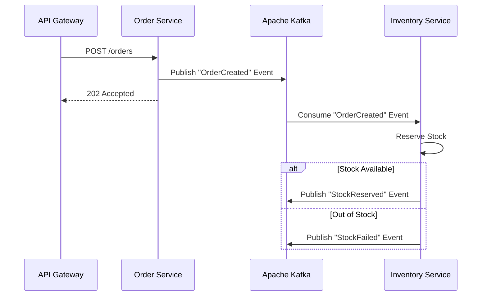

This post verifies that the site's rendering pipeline supports all required technical writing formats seamlessly.

## 1. Standard Markdown

You can write normal markdown content easily:
* **Bold text** and *italic text*.
* Lists with multiple items.
* [Links to external sites](https://youssef-bensalem.com)
* Blockquotes for important callouts.

> "A well-architected system is a joy to behold." 
> — Youssef Ben Salem

## 2. Source Code Highlighting

Writing code is natively supported via Hugo's Chroma syntax highlighter. Here is a quick Python script:

```python
def fibonacci(n):
    """Return the nth Fibonacci number."""
    if n <= 0:
        return 0
    elif n == 1:
        return 1
    else:
        return fibonacci(n-1) + fibonacci(n-2)

print(fibonacci(10))
```

And here is some `inline code` for quick references!

## 3. Mermaid Diagrams

We have dynamically injected Mermaid.js so it only loads when needed. Here is a complex sequence diagram describing an Event-Driven Architecture:



## 4. Excalidraw Architecture

As discussed, Excalidraw diagrams are exported as vector graphics (`.svg`) for perfect, responsive, and blazing-fast loading.



## 5. Standard Graphics (Raster Images)

For standard images like PNGs, JPEGs, or WebP files, you can use the `figure` shortcode. It inherits the identical premium UI presentation as the code and diagram blocks!

