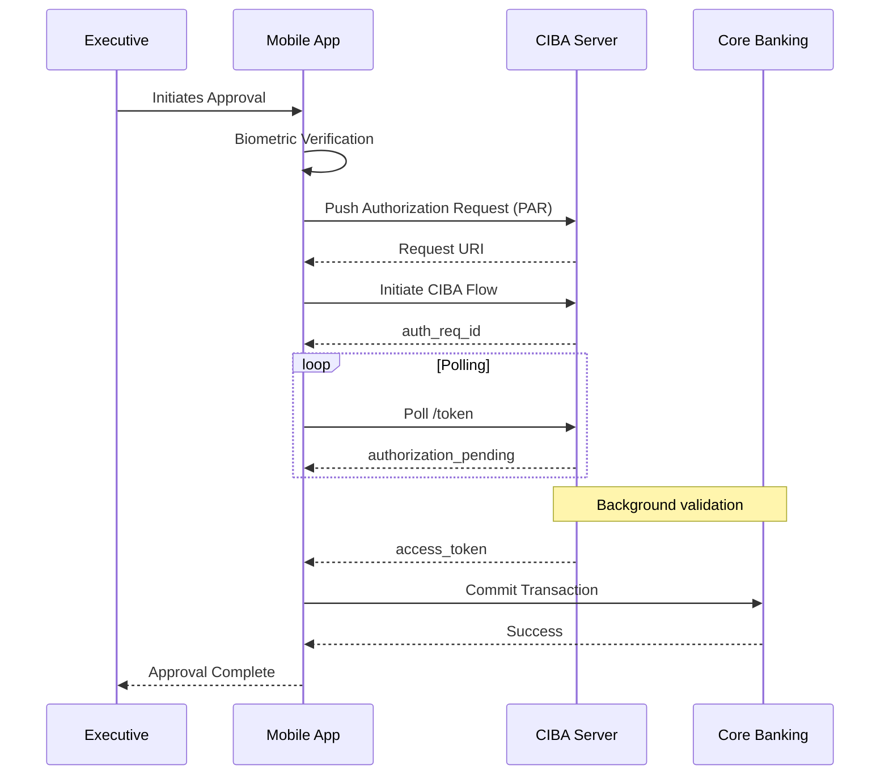

<section class="max-w-4xl mx-auto px-4 md:px-0">

}}" alt="Afreximbank Connect Logo" class="w-16 h-16 object-contain" />

<h2 class="text-3xl font-bold text-text-primary mb-2">Secure Mobile Connectivity</h2>

Delivering robust, real-time transaction approvals with uncompromising security.

Afreximbank Connect represents the pinnacle of banking-grade mobile security, providing a highly secure gateway for real-time transaction approvals and executive connectivity. Built with <strong>Flutter</strong> for seamless performance across iOS and Android, the application integrates tightly with <strong>Auth0</strong> to deliver state-of-the-art authentication mechanisms.

At the core of this platform is a rigorous adherence to <strong>Clean Architecture</strong>, ensuring maintainability, scalability, and airtight security protocols.

Flutter
iOS & Android
Auth0
Clean Architecture
Banking-grade Security

</section>

<section class="max-w-6xl mx-auto px-4 md:px-0">

<h3 class="text-2xl font-bold text-text-primary mb-4">Banking-Grade Security</h3>

The application implements an exhaustive suite of security protocols designed to protect sensitive financial data and ensure non-repudiation in transaction approvals.

<h4 class="text-lg font-semibold text-text-primary mb-2">Advanced MFA & Biometrics</h4>

Multi-factor authentication combining biometric verification (FaceID/TouchID), secure PIN, and cryptographic device authentication.

<h4 class="text-lg font-semibold text-text-primary mb-2">CIBA & PAR Integration</h4>

Leveraging Client Initiated Backchannel Authentication (CIBA) and Push Authorization Requests (PAR) for secure, decoupled transaction approvals away from the primary channel.

<h4 class="text-lg font-semibold text-text-primary mb-2">TOTP Generation</h4>

Integrated Time-based One-Time Password generation for fallback authentication and offline verification scenarios.

{}

{}

</section>

<section class="max-w-4xl mx-auto px-4 md:px-0 pb-16 mt-16">

<h3 class="text-2xl font-bold text-text-primary mb-4">Official App Stores</h3>

View the Afreximbank Connect application on the official platforms. Please note that application access and secure provisioning are strictly restricted to authorized bank clients and executives.

<a href="https://apps.apple.com/us/app/afreximbank-secure-connect/id6740484017" target="_blank" rel="noopener noreferrer" class="flex items-center justify-between bg-bg-secondary p-6 rounded-xl border border-border-color hover:border-brand-primary/50 transition-all group">

<h4 class="font-semibold text-text-primary mb-1">App Store</h4>

View on iOS Platform

<svg class="w-6 h-6 text-brand-primary transform group-hover:translate-x-1 transition-transform" fill="none" stroke="currentColor" viewBox="0 0 24 24"><path stroke-linecap="round" stroke-linejoin="round" stroke-width="2" d="M14 5l7 7m0 0l-7 7m7-7H3"></path></svg>
</a>
<a href="https://play.google.com/store/apps/details?id=com.afreximbank.connect.prod&hl" target="_blank" rel="noopener noreferrer" class="flex items-center justify-between bg-bg-secondary p-6 rounded-xl border border-border-color hover:border-brand-primary/50 transition-all group">

<h4 class="font-semibold text-text-primary mb-1">Google Play</h4>

View on Android Platform

<svg class="w-6 h-6 text-brand-primary transform group-hover:translate-x-1 transition-transform" fill="none" stroke="currentColor" viewBox="0 0 24 24"><path stroke-linecap="round" stroke-linejoin="round" stroke-width="2" d="M14 5l7 7m0 0l-7 7m7-7H3"></path></svg>
</a>

</section>

