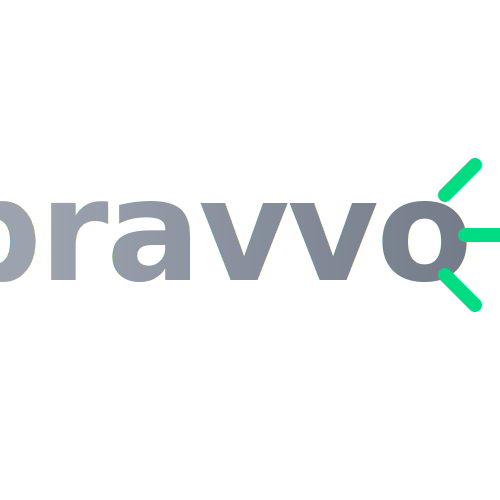

<strong class="text-text-primary dark:text-text-primary font-bold">Driving ESG Impact Through Employee Engagement:</strong> Bravvo V2 is the ultimate employee engagement and sustainability platform. It transforms corporate ESG (Environmental, Social, and Governance) goals into actionable, daily habits. By leveraging gamification and intelligent challenges, Bravvo empowers employees to act, learn, and contribute to real-world impact in just 10 minutes a day.

<i class="fas fa-leaf"></i>

ESG Impact Tracking

<i class="fas fa-tasks"></i>

Daily Micro-Challenges

<i class="fas fa-robot"></i>

AI Peer Recognition

<section>
<h2 class="text-3xl font-bold text-text-primary dark:text-text-primary mb-6 flex items-center gap-3">
<i class="fas fa-seedling"></i>
Cultivating a Sustainable Corporate Culture
</h2>

The core philosophy behind Bravvo is making sustainability accessible and measurable. Whether an employee is learning about carbon footprints or tracking their personal water savings, the platform provides tailored paths that align with individual interests and corporate culture.

<h3 class="text-xl font-bold text-text-primary dark:text-text-primary mb-3 flex items-center gap-2">
<i class="fas fa-bolt text-primary"></i> Engaging Micro-Challenges
</h3>

Users receive daily, personalized challenges designed to fit seamlessly into their routine.

<ul class="space-y-2 text-sm text-text-secondary">
<li class="flex items-start gap-2"><i class="fas fa-check-circle text-primary mt-1"></i> <strong>Act:</strong> Take concrete steps to reduce environmental footprint.</li>
<li class="flex items-start gap-2"><i class="fas fa-check-circle text-primary mt-1"></i> <strong>Learn:</strong> Discover new sustainability practices.</li>
<li class="flex items-start gap-2"><i class="fas fa-check-circle text-primary mt-1"></i> <strong>Suggest:</strong> Propose innovative eco-friendly ideas.</li>
</ul>

<h3 class="text-xl font-bold text-text-primary dark:text-text-primary mb-3 flex items-center gap-2">
<i class="fas fa-chart-line text-primary"></i> Tangible Impact Metrics
</h3>

A robust analytics dashboard actively measures key ESG indicators across departments:

<ul class="space-y-2 text-sm text-text-secondary">
<li class="flex items-start gap-2"><i class="fas fa-arrow-down text-emerald-500 mt-1"></i> CO₂ emission reductions</li>
<li class="flex items-start gap-2"><i class="fas fa-tint text-blue-400 mt-1"></i> Total water savings</li>
<li class="flex items-start gap-2"><i class="fas fa-recycle text-emerald-500 mt-1"></i> Waste minimization tracking</li>
</ul>

</section>

<section>
<h2 class="text-3xl font-bold text-text-primary dark:text-text-primary mb-6 flex items-center gap-3">
<i class="fas fa-network-wired"></i>
AI-Augmented Architecture
</h2>

Underneath its polished UI lies a resilient microservices architecture built for the modern enterprise, ensuring security, scalability, and seamless integration:

<i class="fab fa-react text-primary text-xl"></i>

<h4 class="font-bold text-text-primary">Frontend Experience</h4>

A highly responsive React JS interface that delivers a consumer-grade user experience to enterprise employees.

<i class="fas fa-server text-primary text-xl"></i>

<h4 class="font-bold text-text-primary">Orchestration & Logic</h4>

Loopback JS microservices power the backend, ensuring independent scaling for heavy AI workloads and analytics processing.

<i class="fas fa-shield-alt text-primary text-xl"></i>

<h4 class="font-bold text-text-primary">Identity & Security</h4>

A Multi-provider SSO implementation guarantees that enterprise data remains secure while providing frictionless access.

</section>

