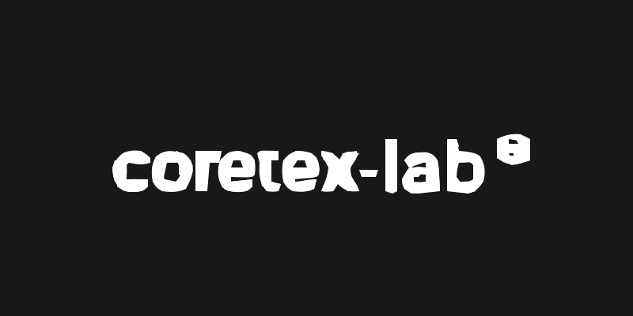

<strong class="text-text-primary dark:text-text-primary font-bold">Digitizing Textile Quality Assurance:</strong> Coretex digi-Q is a unified quality control platform deployed across the textile industry. It replaces legacy paper-based processes with an offline-first tablet application for inspectors and a powerful React JS dashboard for management, fully integrated with AQL (Acceptable Quality Limit) statistical models.

<i class="fas fa-mobile-alt"></i>

Offline-First Mobile

<i class="fas fa-chart-pie"></i>

AQL Statistical Engine

<i class="fas fa-file-pdf"></i>

Automated PDF Reports

<section>
<h2 class="text-3xl font-bold text-text-primary dark:text-text-primary mb-6 flex items-center gap-3">
<i class="fas fa-tablet-alt"></i>
Flutter Tablet Experience
</h2>

Textile factories often have unreliable network coverage. The Flutter-based tablet application was architected with an offline-first approach, ensuring inspectors can conduct rigorous quality checks without interruption.

<h3 class="text-xl font-bold text-text-primary dark:text-text-primary mb-3 flex items-center gap-2">
<i class="fas fa-search text-primary"></i> Comprehensive Inspections
</h3>
<ul class="space-y-2 text-sm text-text-secondary">
<li class="flex items-start gap-2"><i class="fas fa-check-circle text-primary mt-1"></i> <strong>EAN Barcode Scanning:</strong> Rapid identification of production batches.</li>
<li class="flex items-start gap-2"><i class="fas fa-check-circle text-primary mt-1"></i> <strong>Defect Capture:</strong> Native camera integration to photograph and annotate critical, major, and minor defects.</li>
<li class="flex items-start gap-2"><i class="fas fa-check-circle text-primary mt-1"></i> <strong>Digital Signatures:</strong> On-screen signature capture for immediate validation and compliance.</li>
</ul>

<h3 class="text-xl font-bold text-text-primary dark:text-text-primary mb-3 flex items-center gap-2">
<i class="fas fa-sync text-primary"></i> Asynchronous Synchronization
</h3>

All inspection data is stored locally on the device using secure storage, and asynchronously synchronized to the Nest JS backend utilizing an intelligent conflict-resolution queue once connectivity is restored.

</section>

<section>
<h2 class="text-3xl font-bold text-text-primary dark:text-text-primary mb-6 flex items-center gap-3">
<i class="fas fa-desktop"></i>
Enterprise Dashboard & AQL Analytics
</h2>

The React JS Back-Office empowers administrators and clients with real-time visibility into production quality, driving data-informed decisions.

<i class="fas fa-calculator text-primary text-xl"></i>

<h4 class="font-bold text-text-primary">AQL Statistical Engine</h4>

Automated evaluation of production batches using the Acceptance Quality Limit (AQL) methodology. The system mathematically determines the required sample size and dynamically calculates Pass/Fail thresholds based on established critical, major, and minor defect tolerances.

<i class="fas fa-file-export text-primary text-xl"></i>

<h4 class="font-bold text-text-primary">Automated PDF Generation</h4>

Instantaneous generation of professional PDF inspection reports, stored securely in Google Storage and distributed to stakeholders via automated emails.

<i class="fas fa-bell text-primary text-xl"></i>

<h4 class="font-bold text-text-primary">Real-time Alerting</h4>

Integration with OneSignal pushes critical quality alerts to the relevant managers the moment an inspection fails.

</section>

<section>
<h2 class="text-3xl font-bold text-text-primary dark:text-text-primary mb-6 flex items-center gap-3">
<i class="fas fa-images"></i>
System Artifacts
</h2>
{{< gallery 
  "images/1.png" "images/3.jpg" "images/6.png" "images/7.png" "images/8.png" "images/9.png" "images/10.png" "images/12.png" "images/13.png" "images/15.png" "images/16.png" "images/17.png" "images/18.png" "images/19.png" "images/21.png" "images/22.png" "images/23.png" "images/24.png" "images/26.png" "images/28.png" "images/29.png" "images/30.png" "images/31.png" "images/34.png" "images/37.png" "images/40.png" "images/41.png" "images/42.png" "images/44.png" "images/48.png" "images/51.png" "images/53.png" "images/55.png" "images/56.png" "images/57.png" "images/58.png" "images/59.png" "images/67.png" "images/68.png" "images/71.png" "images/72.png" "images/73.png"
>}}
</section>

