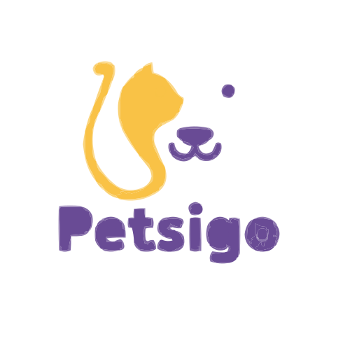

<strong class="text-text-primary dark:text-text-primary font-bold">A Mobile-Centric Approach to Pet Insurance:</strong> Pestsigo is Tunisia’s first mobile app dedicated to pet insurance. It is transforming how pet owners access and manage insurance services. Designed to meet the unique needs of Tunisian pet owners, it offers comprehensive, user-friendly insurance solutions directly on a mobile platform.

<i class="fas fa-paw"></i>

Tailor-Made Coverage

<i class="fas fa-mobile-alt"></i>

Intuitive Interface

<i class="fas fa-headset"></i>

Real-Time Assistance

<section>
<h2 class="text-3xl font-bold text-text-primary dark:text-text-primary mb-6 flex items-center gap-3">
<i class="fas fa-exclamation-circle"></i>
The Challenge
</h2>

Before Pestsigo, pet owners in Tunisia faced several significant obstacles in securing adequate protection for their furry friends:

<i class="fas fa-search text-primary text-xl"></i>

<h4 class="font-bold text-text-primary">Limited Options</h4>

Traditional pet insurance options were few and often hard to access for the average consumer.

<i class="fas fa-file-signature text-primary text-xl"></i>

<h4 class="font-bold text-text-primary">Complex Processes</h4>

Obtaining and managing pet insurance required navigating time-consuming procedures and endless paperwork.

<i class="fas fa-ban text-primary text-xl"></i>

<h4 class="font-bold text-text-primary">Lack of Digital Solutions</h4>

There was a significant lack of digital tools tailored to pet insurance, leaving many pet owners feeling underserved.

</section>

<section>
<h2 class="text-3xl font-bold text-text-primary dark:text-text-primary mb-6 flex items-center gap-3">
<i class="fas fa-lightbulb"></i>
The Solution
</h2>

Pestsigo was created to fill this gap by offering a fully digital, mobile solution that simplifies the entire insurance process from policy acquisition to claims management.

<h3 class="text-xl font-bold text-text-primary dark:text-text-primary mb-3 flex items-center gap-2">
<i class="fas fa-layer-group text-primary"></i> Key Features
</h3>
<ul class="space-y-3 text-sm text-text-secondary">
<li class="flex items-start gap-2"><i class="fas fa-check-circle text-primary mt-1"></i> <strong>Intuitive Interface:</strong> An easy-to-use application that enables pet owners to quickly understand, purchase, and manage insurance policies.</li>
<li class="flex items-start gap-2"><i class="fas fa-check-circle text-primary mt-1"></i> <strong>Tailor-made Coverage:</strong> Customizable plans designed for different pet types and owner needs, developed with local insurance providers.</li>
<li class="flex items-start gap-2"><i class="fas fa-check-circle text-primary mt-1"></i> <strong>Real-time Assistance:</strong> In-app resources and customer support enable rapid assistance and educational content.</li>
</ul>

<h3 class="text-xl font-bold text-text-primary dark:text-text-primary mb-3 flex items-center gap-2">
<i class="fas fa-server text-primary"></i> Technology Stack
</h3>
<ul class="space-y-2 text-sm text-text-secondary">
<li class="flex items-center gap-2"><i class="fab fa-app-store-ios text-primary"></i> Flutter Mobile App</li>
<li class="flex items-center gap-2"><i class="fab fa-react text-primary"></i> React JS Dashboard</li>
<li class="flex items-center gap-2"><i class="fab fa-node-js text-primary"></i> Nest JS Backend</li>
<li class="flex items-center gap-2"><i class="fas fa-database text-primary"></i> MongoDB</li>
<li class="flex items-center gap-2"><i class="fas fa-bell text-primary"></i> Firebase Cloud Messaging (FCM)</li>
<li class="flex items-center gap-2"><i class="fas fa-credit-card text-primary"></i> Secure Payment Gateway</li>
</ul>

</section>

<section>
<h2 class="text-3xl font-bold text-text-primary dark:text-text-primary mb-6 flex items-center gap-3">
<i class="fas fa-mobile-alt"></i>
App Interfaces
</h2>

</section>

