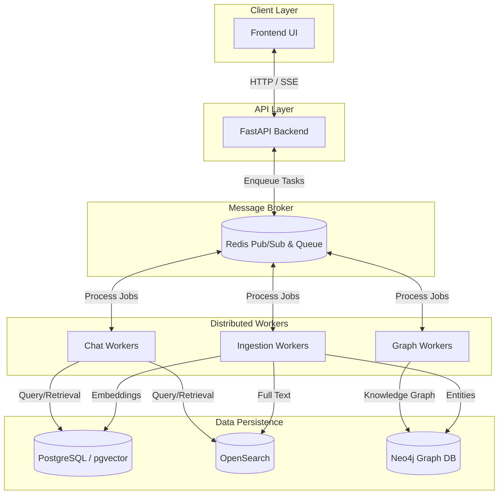

<!-- Section 1 -->

<h2 class="text-2xl font-bold text-gray-900 dark:text-white mb-6 flex items-center gap-3">
<i class="fas fa-network-wired text-cyan-500"></i> Distributed Worker Architecture
</h2>

Tahut KMS utilizes a feature-flagged isolation pattern to separate heavy machine learning tasks from the fast API layer. This ensures the main API remains highly responsive, even under extreme indexing or chat load.

<ul class="space-y-2 mt-4 list-none">
<li class="flex items-start gap-2"><i class="fas fa-check-circle text-cyan-500 mt-1"></i> <strong>FastAPI Load Balancer:</strong> Handles all HTTP routing, authentication, and SSE relaying.</li>
<li class="flex items-start gap-2"><i class="fas fa-check-circle text-cyan-500 mt-1"></i> <strong>Redis Queue (RQ):</strong> Serves as both the task queue and the pub/sub event bus.</li>
<li class="flex items-start gap-2"><i class="fas fa-check-circle text-cyan-500 mt-1"></i> <strong>Distributed Workers:</strong> Independent nodes handling Ingestion, Chat, and Graph workloads.</li>
</ul>

<!-- Section 2 -->

<h2 class="text-2xl font-bold text-gray-900 dark:text-white mb-4 flex items-center gap-3">
<i class="fas fa-file-import text-blue-500"></i> Seamless Asynchronous Ingestion
</h2>

The platform features an intelligent, fully asynchronous ingestion pipeline. Document processing automatically executes multi-layered OCR, extracts critical semantic data, and generates precise vector embeddings—all while pushing live progress updates directly to the interface via Server-Sent Events. This ensures zero downtime or page refreshes for the end user.

<h2 class="text-2xl font-bold text-gray-900 dark:text-white mb-4 flex items-center gap-3">
<i class="fas fa-microchip text-purple-500"></i> Advanced Hardware Optimization
</h2>

Engineered for scale and continuous operation, the system utilizes strict, hardware-agnostic memory management algorithms. By actively optimizing resource allocation across execution layers—including PyTorch and Apple Metal Performance Shaders (MPS)—the platform guarantees sustained, high-performance processing without the risk of memory degradation over time.

<h2 class="text-2xl font-bold text-gray-900 dark:text-white mb-4 flex items-center gap-3">
<i class="fas fa-file-pdf text-red-500"></i> Deep Document Understanding (Docling & Unstructured)
</h2>

To support the extreme file variability typical in highly regulated enterprise environments, the ingestion engine is powered by industry-leading semantic parsing frameworks: <strong>Docling</strong> and <strong>Unstructured.io</strong>.

<ul class="space-y-2 list-none">
<li class="flex items-start gap-3"><i class="fas fa-check-circle text-cyan-500 mt-1.5 flex-shrink-0"></i> <strong>Layout-Aware Parsing:</strong> Accurately extracts text while mathematically preserving complex visual hierarchies such as multi-column layouts, nested tables, and embedded charts.</li>
<li class="flex items-start gap-3"><i class="fas fa-check-circle text-cyan-500 mt-1.5 flex-shrink-0"></i> <strong>Multi-Modal Ingestion:</strong> Seamlessly processes dense PDFs, Word documents, PowerPoint presentations, and raw images before pushing clean, semantic chunks to the vectorization pipeline.</li>
</ul>

<!-- Section 3 -->

<h2 class="text-2xl font-bold text-gray-900 dark:text-white mb-6">System Overview Dashboard</h2>

}}" alt="System Overview Dashboard" class="w-full h-auto object-contain rounded-lg">

