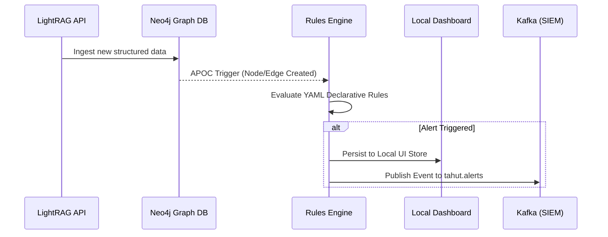
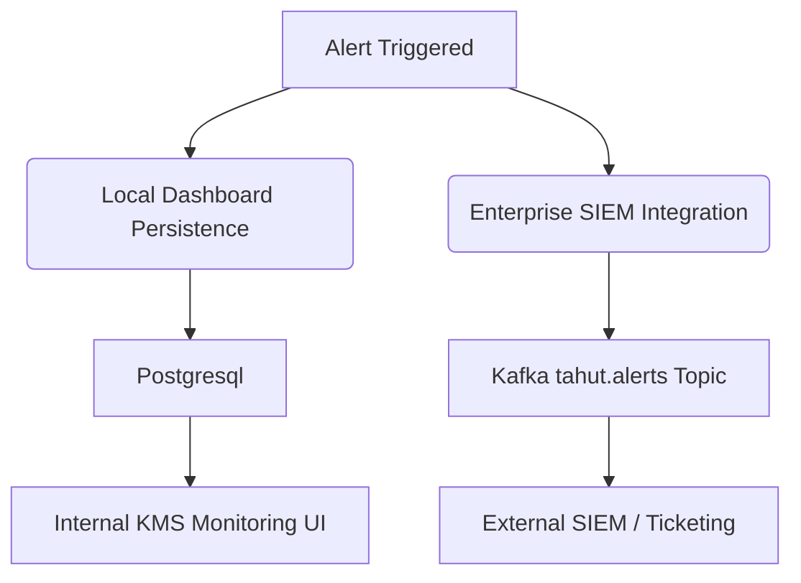

<!-- Section 1 -->

<h2 class="text-2xl font-bold text-gray-900 dark:text-white mb-6 flex items-center gap-3">
<i class="fas fa-eye text-yellow-500"></i> From Passive Repository to Active Intelligence
</h2>

The design of the "Eye of Horus" collection represents a significant architectural evolution for the Tahut Knowledge Management System (KMS), transforming it from a passive repository of information into a dynamic, intelligent monitoring platform.

The core objective is to introduce an active intelligence layer capable of detecting predefined alerts based on the continuous analysis of interconnected data. This requires a carefully designed multi-component architecture that integrates seamlessly with the existing KMS infrastructure.

<h3 class="font-bold text-xl text-gray-900 dark:text-white mb-2 flex items-center gap-2">
<i class="fas fa-bolt text-yellow-500"></i> 1. Real-time Stream Analysis
</h3>

Analyzing incoming data streams via the LightRAG API pipelines the moment they enter the system.

<h3 class="font-bold text-xl text-gray-900 dark:text-white mb-2 flex items-center gap-2">
<i class="fas fa-sync text-blue-500"></i> 2. Continuous Re-evaluation
</h3>

Continuously re-evaluating the entire Neo4j knowledge graph for emerging patterns and hidden relationships.

<!-- Section 2 -->

<h2 class="text-2xl font-bold text-gray-900 dark:text-white mb-6 flex items-center gap-3">
<i class="fas fa-cogs text-gray-500"></i> Configuration-Driven Rules Engine
</h2>

The cornerstone of the "Eye of Horus" collection is its declarative rules engine. Designed to be fundamentally "configuration-driven", it provides a flexible, non-code-based alerting system.

<ul class="space-y-4 list-none text-lg text-gray-600 dark:text-gray-300">
<li class="flex items-start gap-3">

<i class="fas fa-file-code text-purple-600 dark:text-purple-400"></i>

<strong>Declarative Schemas:</strong> Administrators can define, modify, and manage detection logic through human-readable JSON or YAML schemas.

</li>
<li class="flex items-start gap-3">

<i class="fas fa-project-diagram text-green-600 dark:text-green-400"></i>

<strong>Graph Pattern Matching:</strong> The engine leverages Neo4j's expressive Cypher query language to execute complex pattern matching across the graph.

</li>
<li class="flex items-start gap-3">

<i class="fas fa-fire text-red-600 dark:text-red-400"></i>

<strong>APOC Triggers:</strong> Utilizing the Awesome Procedures on Cypher (APOC) library, lightweight triggers execute upon the creation of new nodes or relationships.

</li>
</ul>

<!-- Section 3 -->

<h2 class="text-2xl font-bold text-gray-900 dark:text-white mb-6 flex items-center gap-3">
<i class="fas fa-project-diagram text-cyan-500"></i> Dual-Path Alert Distribution
</h2>

Upon the successful firing of a rule, the system must persist the resulting alert and distribute it effectively to the broader enterprise ecosystem.

<i class="fas fa-database text-2xl text-cyan-500"></i>
<h3 class="font-bold text-xl text-gray-900 dark:text-white">Local Dashboard Persistence</h3>

The first persistence target is a local storage area (optimized NoSQL or relational), designated exclusively for the internal KMS monitoring dashboard.

<i class="fas fa-stream text-2xl text-orange-500"></i>
<h3 class="font-bold text-xl text-gray-900 dark:text-white">Enterprise SIEM Integration</h3>

Simultaneously, the alert payload is formatted and published to a designated Kafka topic (<code>tahut.alerts</code>). This high-throughput messaging bus ensures alerts are reliably delivered to Security Information and Event Management (SIEM) platforms or ticketing systems in real-time.

<h3 class="text-xl font-bold text-gray-900 dark:text-white mb-4 mt-8 flex items-center gap-2">
<i class="fas fa-sitemap text-blue-500"></i> System Architecture Flow
</h3>

<h3 class="text-xl font-bold text-gray-900 dark:text-white mb-4 mt-8 flex items-center gap-2">
<i class="fas fa-share-alt text-green-500"></i> Alert Routing Logic
</h3>

