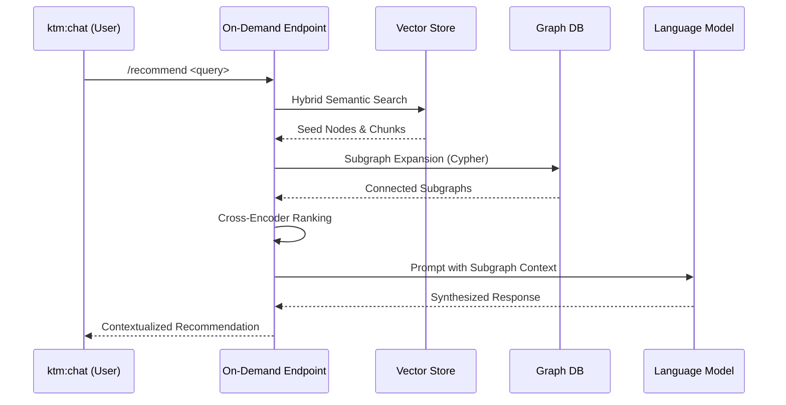
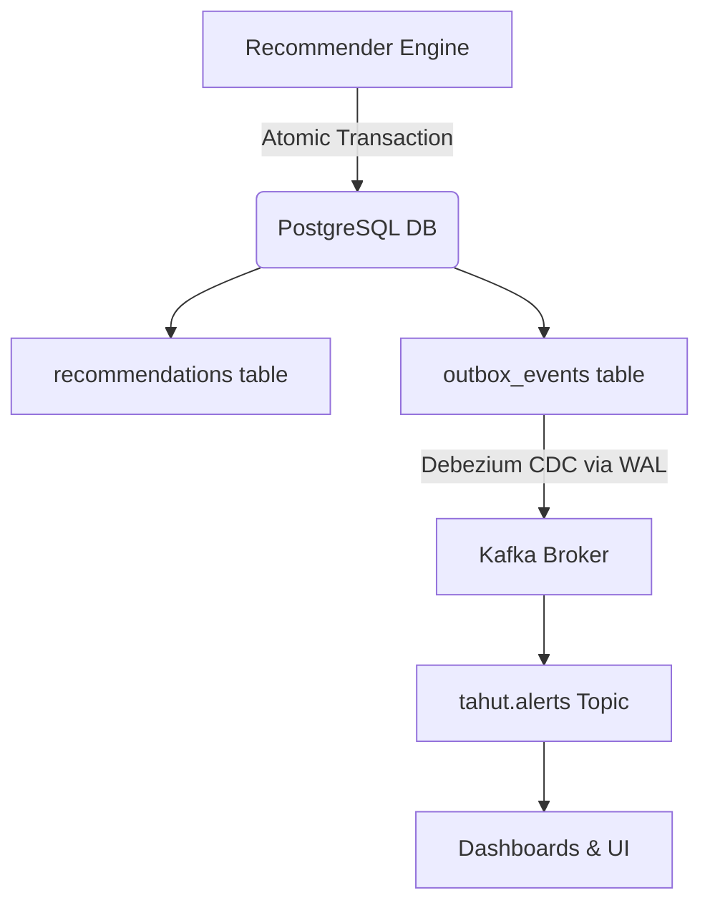

<!-- Section 1 -->

<h2 class="text-2xl font-bold text-gray-900 dark:text-white mb-6 flex items-center gap-3">
<i class="fas fa-brain text-purple-500"></i> Unified Graph-Centric Architecture
</h2>

The design of the "Sia" Recommender System introduces a dual-pipeline architecture for the Tahut Knowledge Management System (KMS). It creates a parallel system that operates concurrently with the real-time monitoring engine without duplicating data ingestion efforts.

By centering on Neo4j as the central nervous system, Sia decouples the business logic of recommending from alerting while sharing a single source of truth—providing a scalable platform for active intelligence.

<h3 class="font-bold text-xl text-gray-900 dark:text-white mb-2 flex items-center gap-2">
<i class="fas fa-magic text-purple-500"></i> 1. Rule-Based Engine
</h3>

Executes pre-configured Cypher queries against the live graph to identify specific patterns and generate proactive recommendations in real-time.

<h3 class="font-bold text-xl text-gray-900 dark:text-white mb-2 flex items-center gap-2">
<i class="fas fa-search text-blue-500"></i> 2. On-Demand GraphRAG
</h3>

Processes natural language requests using a sophisticated Graph Retrieval-Augmented Generation pipeline, synthesizing answers via LLMs.

<!-- Section 2 -->

<h2 class="text-2xl font-bold text-gray-900 dark:text-white mb-6 flex items-center gap-3">
<i class="fas fa-project-diagram text-green-500"></i> GraphRAG Pipeline
</h2>

Sia enhances traditional RAG by incorporating the explicit structure of the knowledge graph, allowing the LLM to reason across interconnected facts and bridge complex relations.

<ul class="space-y-4 list-none text-lg text-gray-600 dark:text-gray-300">
<li class="flex items-start gap-3">

<i class="fas fa-layer-group text-blue-600 dark:text-blue-400"></i>

<strong>Hybrid Retrieval:</strong> Combines fast semantic search over vector databases (like Qdrant) with graph-aware pre-filtering and subgraph expansion via Cypher.

</li>
<li class="flex items-start gap-3">

<i class="fas fa-sort-amount-up text-indigo-600 dark:text-indigo-400"></i>

<strong>High-Precision Ranking:</strong> Utilizes cross-encoder models (e.g., ms-marco-MiniLM-L-6-v2) and cascaded strategies to jointly attend to queries and candidate documents.

</li>
<li class="flex items-start gap-3">

<i class="fas fa-robot text-green-600 dark:text-green-400"></i>

<strong>Generative Synthesis:</strong> Assembles top-ranked subgraphs and text chunks into prompts for a powerful LLM to synthesize contextual, natural language responses.

</li>
</ul>

<!-- Section 3 -->

<h2 class="text-2xl font-bold text-gray-900 dark:text-white mb-6 flex items-center gap-3">
<i class="fas fa-shield-alt text-cyan-500"></i> Transactional Outbox Pattern
</h2>

A critical challenge of dual writes to PostgreSQL and Kafka is elegantly solved using the Transactional Outbox Pattern to ensure strong eventual consistency.

<i class="fas fa-database text-2xl text-cyan-500"></i>
<h3 class="font-bold text-xl text-gray-900 dark:text-white">Atomic Commits</h3>

The system inserts recommendation data and corresponding event records into an <code>outbox_events</code> table within a single ACID-compliant PostgreSQL transaction.

<i class="fas fa-stream text-2xl text-orange-500"></i>
<h3 class="font-bold text-xl text-gray-900 dark:text-white">CDC Event Streaming</h3>

Change Data Capture (CDC) tools like Debezium read the database's Write-Ahead Log (WAL) to stream changes to Kafka reliably, avoiding message loss or duplication.

<h3 class="text-xl font-bold text-gray-900 dark:text-white mb-4 mt-8 flex items-center gap-2">
<i class="fas fa-sitemap text-blue-500"></i> GraphRAG Query Flow
</h3>

<h3 class="text-xl font-bold text-gray-900 dark:text-white mb-4 mt-8 flex items-center gap-2">
<i class="fas fa-share-alt text-green-500"></i> Outbox Pattern Logic
</h3>

